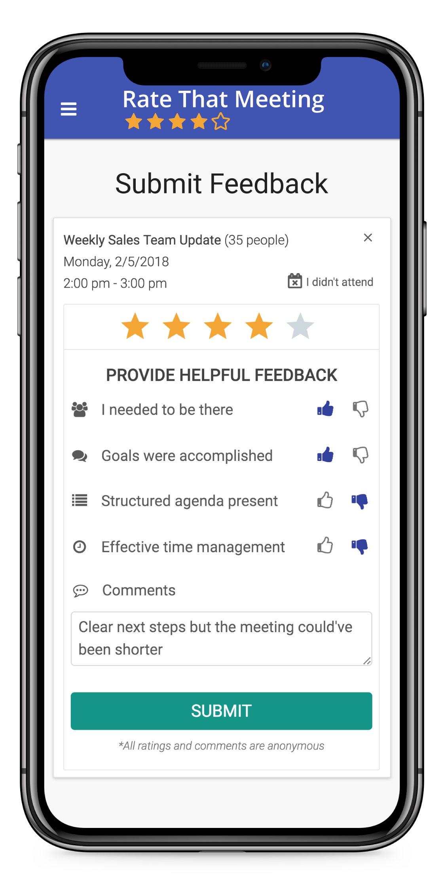

From September 2017 to May 2018, I built [Rate That Meeting](https://ratethatmeeting.com/).

The platform had two core components: an automated way to collect anonymous feedback from meeting participants, and a team dashboard to help managers and executives see how their team spends their time in meetings.

We shipped this to hundreds of users at over 50 companies.

